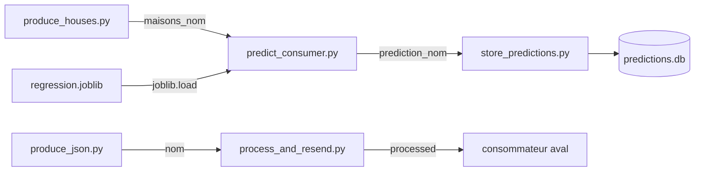

# Kafka, du message brut au modèle en production

Les exercices du module *Big data avec Kafka*, du premier « coucou » sur un
canal jusqu'à un modèle de machine learning qui prédit à la volée et republie
ses résultats.

M2 Data Engineering & IA, EFREI. Auteur : Adam BELOUCIF
([Adam-Blf](https://github.com/Adam-Blf)).

## La chaîne, en un coup d'œil



Chaque maillon lit un canal, fait une chose, écrit sur le suivant. Aucun ne
connaît les autres : c'est ce découplage qui permet d'ajouter le stockage sans
toucher au prédicteur.

## Installation

```bash
uv venv .venv
VIRTUAL_ENV=.venv uv pip install -r requirements.txt
.venv/Scripts/python train_model.py     # écrit regression.joblib
```

L'adresse du broker vient de l'environnement, jamais du code :

```bash
# En cours, avec l'adresse donnée par le formateur
export KAFKA_BOOTSTRAP=10.0.0.1:9092

# En local, avec le Kafka de ce dépôt
docker compose up -d          # KRaft, sans ZooKeeper, deux partitions par défaut
export KAFKA_BOOTSTRAP=localhost:9092
```

`KAFKA_NOM` fixe le nom de famille utilisé pour les canaux personnels
(`beloucif` par défaut), ce qui permet de rejouer les exercices sans écraser
ceux d'un camarade.

## Les exercices

### 1. Un consommateur, un producteur

```bash
.venv/Scripts/python exercices/consume.py     # terminal 1, ne rend jamais la main
.venv/Scripts/python exercices/produce.py     # terminal 2
```

Deux terminaux, deux processus. Un carnet Jupyter ne convient pas : la boucle
de consommation bloque le noyau, et le producteur ne peut plus s'exécuter.

Le consommateur qui ne s'arrête pas est le comportement **attendu**. S'il rend
la main tout de suite, c'est l'adresse du broker qui est fausse.

### 2. Échanger du JSON, et la question des deux consommateurs

```bash
.venv/Scripts/python exercices/produce_json.py
.venv/Scripts/python exercices/consume_json.py --etiquette a
.venv/Scripts/python exercices/consume_json.py --etiquette b
```

Kafka ne transporte que des octets : le JSON s'encode en UTF-8 à l'émission et
se décode à la réception. Le consommateur reconstruit un tableau numpy et en
affiche la somme.

**La réponse à la question du sujet.** Sans `group_id`, les deux consommateurs
reçoivent chacun le message : c'est de la diffusion. Avec un `group_id` commun,
Kafka assigne chaque partition à exactement un consommateur du groupe, donc un
seul traite le message.

```bash
.venv/Scripts/python exercices/consume_json.py --groupe essai --etiquette ga
.venv/Scripts/python exercices/consume_json.py --groupe essai --etiquette gb
```

Conséquence directe : le parallélisme d'un groupe est **borné par le nombre de
partitions**. À une seule partition, ajouter des consommateurs n'accélère rien,
les autres restent inactifs.

### 3. Consommateur et producteur à la fois

```bash
.venv/Scripts/python exercices/process_and_resend.py
```

Lit le canal de données, calcule la somme, republie sur `processed`.

### 11. Le modèle en production

```bash
.venv/Scripts/python exercices/tester_modele.py               # étape 4
.venv/Scripts/python exercices/predict_consumer.py --publier  # étapes 5, 6, 7
.venv/Scripts/python exercices/produce_houses.py --nombre 5
.venv/Scripts/python exercices/store_predictions.py           # bonus, étape 8
```

Le modèle est chargé **une fois avant la boucle**. Le charger à chaque message
coûterait une lecture disque et une désérialisation par prédiction, ce qui
domine largement le calcul lui-même sur une régression linéaire.

Pour l'étape 9, la parallélisation sans doublon :

```bash
.venv/Scripts/python exercices/predict_consumer.py --publier --groupe predicteurs --etiquette p1
.venv/Scripts/python exercices/predict_consumer.py --publier --groupe predicteurs --etiquette p2
```

### 12. Kafka en local

`docker-compose.yml` lance un broker en mode **KRaft**, c'est-à-dire sans
ZooKeeper. Le sujet décrit le montage historique en deux processus,
`zookeeper-server-start.sh` puis `kafka-server-start.sh` ; depuis Kafka 4.0,
ZooKeeper a disparu et le contrôleur est interne. Les deux montages servent le
même protocole côté client.

Le nombre de partitions par défaut se règle par `KAFKA_NUM_PARTITIONS` dans le
compose, l'équivalent de `num.partitions` dans `server.properties`. Vérification
par la méthode demandée :

```bash
.venv/Scripts/python exercices/compter_partitions.py maisons_beloucif
```

## Preuve exécutée

```bash
.venv/Scripts/python verifier.py
```

Lance les consommateurs, envoie les messages, coupe, puis relit ce que chacun a
réellement affiché. Un exercice n'est pas fait parce que le script existe, il
est fait quand on a vu le message arriver.

Dix vérifications, dont la diffusion contre le groupe, la chaîne à trois
maillons et le stockage en base.

## Deux pièges rencontrés

**`send` est asynchrone.** Sans `flush` ou sans `close`, un script court se
termine avant que le message parte. Rien n'arrive, et aucune erreur n'est levée.

**Un consommateur qui démarre ne lit que la suite.** Sans
`auto_offset_reset="earliest"`, on croit le canal vide alors qu'il contient tout
l'historique.

## Structure

```
.
├── config.py                      # adresse du broker et noms de canaux
├── train_model.py                 # entraînement fourni par le cours
├── houses.csv                     # jeu de données fourni
├── modele/
│   └── chargement.py              # charge le modèle et prédit
├── exercices/
│   ├── consume.py                 # exercice 1
│   ├── produce.py                 # exercice 1
│   ├── produce_json.py            # exercice 2
│   ├── consume_json.py            # exercice 2, avec ou sans groupe
│   ├── process_and_resend.py      # exercice 3
│   ├── tester_modele.py           # exercice 11, étape 4
│   ├── produce_houses.py          # exercice 11
│   ├── predict_consumer.py        # exercice 11, étapes 5 à 9
│   ├── store_predictions.py       # exercice 11, bonus
│   └── compter_partitions.py      # exercice 12, étape 10
├── verifier.py                    # preuve exécutée de bout en bout
└── docker-compose.yml             # Kafka local en mode KRaft
```

`regression.joblib` et `predictions.db` ne sont pas versionnés : le premier se
régénère par `train_model.py`, le second se remplit tout seul à l'écoute.
